# 🎯 Smart Helpdesk - AI-Powered Support System

> **A comprehensive helpdesk system with intelligent ticket triage, knowledge base management, and automated response generation using AI workflows.**

[](https://nodejs.org/)
[](https://reactjs.org/)
[](https://mongodb.com/)
[](https://docker.com/)

---

## 🚀 Quick Start

### **One-Click Setup**
```bash
# Windows
start.bat

# Linux/Mac
chmod +x start.sh && ./start.sh
```

### **Manual Setup**
```bash
# 1. Start all services
docker-compose up -d

# 2. Wait for MongoDB (30 seconds)
docker-compose logs mongodb

# 3. Seed test data
docker-compose exec backend npm run seed

# 4. Access application
# Frontend: http://localhost:5173
# Backend:  http://localhost:3000/healthz
```

---

## 🧪 Demo Accounts

| Role | Email | Password | Capabilities |
|------|-------|----------|-------------|
| **User** | `user@helpdesk.com` | `user123` | Create tickets, view responses |
| **Agent** | `agent@helpdesk.com` | `agent123` | Review AI suggestions, resolve tickets |
| **Admin** | `admin@helpdesk.com` | `admin123` | Manage KB, configure system |

---

## 🤖 Agentic Workflow

When a user creates a ticket, the AI system automatically:

```mermaid
graph LR
    A[Ticket Created] --> B[AI Classification]
    B --> C[KB Search]
    C --> D[Draft Generation]
    D --> E{Confidence ≥ 70%?}
    E -->|Yes| F[Auto-Close]
    E -->|No| G[Assign to Agent]
    F --> H[Audit Log]
    G --> H
```



### **AI Classification Logic**
- **Billing**: `refund`, `invoice`, `payment`, `billing`
- **Technical**: `error`, `bug`, `crash`, `broken`
- **Shipping**: `delivery`, `shipment`, `tracking`
- **Other**: Everything else

### **Confidence Scoring**
```javascript
confidence = 0.5 + (keyword_matches * 0.15)
// Capped at 0.9 maximum
```

---

## 🏗️ Architecture


### **Backend Stack**
- **Framework**: Node.js + Express
- **Database**: MongoDB + Mongoose ODM
- **Authentication**: JWT with role-based access
- **AI Provider**: Deterministic stub (no external API needed)
- **Security**: Rate limiting, input validation (Zod), CORS
- **Reliability**: Timeouts, retries, idempotency

### **Frontend Stack**
- **Framework**: React 18 + Vite
- **Routing**: React Router with protected routes
- **State**: Context API + React hooks
- **Styling**: Modern inline styles with responsive design

### **DevOps**
- **Containerization**: Docker + Docker Compose
- **Health Checks**: `/healthz` and `/readyz` endpoints
- **Logging**: Structured JSON logs with trace IDs
- **Testing**: Jest (backend) + Vitest (frontend)

---

## 📊 Data Models

### **Core Entities**

```javascript
// Ticket Lifecycle
Ticket {
  title: String,
  description: String,
  category: ['billing', 'tech', 'shipping', 'other'],
  status: ['open', 'triaged', 'waiting_human', 'resolved', 'closed'],
  createdBy: ObjectId,
  assignee: ObjectId,
  replies: [{ author, content, isAgent, createdAt }]
}

// AI Suggestions
AgentSuggestion {
  ticketId: ObjectId,
  predictedCategory: String,
  confidence: Number,
  draftReply: String,
  articleIds: [ObjectId],
  autoClosed: Boolean,
  modelInfo: { provider, model, promptVersion, latencyMs }
}

// Knowledge Base
Article {
  title: String,
  body: String,
  tags: [String],
  status: ['draft', 'published'],
  author: ObjectId
}
```

---

## 🔌 API Reference

### **Authentication**
```http
POST /api/auth/register    # User registration (role: 'user' only)
POST /api/auth/login       # User login
```

### **Tickets**
```http
GET    /api/tickets                    # List tickets (?status=, ?my=true)
POST   /api/tickets                    # Create ticket (triggers AI triage)
GET    /api/tickets/:id                # Get ticket details
POST   /api/tickets/:id/reply          # Send reply
POST   /api/tickets/:id/assign         # Assign ticket
GET    /api/tickets/:id/audit          # Get audit trail
GET    /api/tickets/:id/audit/export   # Export audit as NDJSON
```

### **Knowledge Base**
```http
GET    /api/kb           # List/search articles (?query=, ?status=)
POST   /api/kb           # Create article (admin only)
PUT    /api/kb/:id       # Update article (admin only)
DELETE /api/kb/:id       # Delete article (admin only)
```

### **AI Agent**
```http
POST /api/agent/triage              # Trigger triage workflow
GET  /api/agent/suggestion/:ticketId # Get AI suggestion
```

### **Configuration**
```http
GET /api/config    # Get system configuration
PUT /api/config    # Update configuration (admin only)
```

---

## 🔒 Security & Reliability Features

### **Security**
- **JWT Authentication** with 24-hour expiry
- **Role-Based Access Control** (User/Agent/Admin)
- **Input Validation** with Zod schemas
- **Rate Limiting** (Auth: 5/15min, API: 100/15min, Mutations: 20/1min)
- **CORS Configuration** for cross-origin requests
- **Password Hashing** with bcrypt
- **No Sensitive Data** in logs or responses

### **Reliability**
- **Timeouts** (5s) for LLM calls
- **Retry Logic** with exponential backoff
- **Idempotency** for triage operations
- **Error Handling** with graceful fallbacks
- **Health Monitoring** with readiness checks

---

## 📈 Observability

### **Logging**
- **Structured JSON** logs with trace IDs
- **Request Logging** (method, path, status, latency)
- **Audit Trail** for complete workflow tracking
- **Error Handling** with centralized middleware

### **Health Monitoring**
```bash
# Application health
curl http://localhost:3000/healthz

# Database readiness
curl http://localhost:3000/readyz
```

---

## 🧪 Testing

### **Run Test Suites**
```bash
# Backend tests (5+ tests)
cd backend && npm test
# Tests: auth, KB CRUD, ticket lifecycle, triage workflow, validation

# Frontend tests (3+ tests)
cd frontend && npm test
# Tests: Login, TicketList, NavBar components

# API integration testing
# Import postman_collection.json into Postman
# Tests: Complete user journey from registration to ticket resolution

# Watch mode for development
cd backend && npm run test:watch
cd frontend && npm run test:watch
```

### **Test Coverage**
- **Backend**: 5+ tests covering auth, KB, tickets, triage, validation
- **Frontend**: 3+ tests covering Login, TicketList, NavBar components
- **Integration**: Complete ticket lifecycle via Postman collection
- **Security**: Rate limiting and input validation tests

---

## 🛠️ Development

### **Local Development**
```bash
# Backend
cd backend
npm install
npm run dev

# Frontend
cd frontend
npm install
npm run dev
```

### **Environment Variables**
```bash
NODE_ENV=development
PORT=3000
MONGODB_URI=mongodb://mongodb:27017/helpdesk
JWT_SECRET=your-secret-key
STUB_MODE=true
OPENAI_API_KEY=your-openai-key  # Optional for real LLM
```

---

## 🎯 Key Features

### **✅ Complete Agentic Workflow**
- Real-time ticket classification
- Intelligent KB article retrieval
- Automated response generation
- Confidence-based decision making

### **✅ Role-Based Experience**
- **Users**: Create tickets, track progress
- **Agents**: Review AI suggestions, resolve tickets
- **Admins**: Manage KB, configure system

### **✅ Production Ready**
- Docker containerization with one-command setup
- Health checks and monitoring endpoints
- Comprehensive audit logging with trace IDs
- Secure authentication with rate limiting
- Input validation and error handling
- Timeout and retry mechanisms
- NDJSON audit export capability

### **✅ Developer Friendly**
- Clean, modular architecture
- Comprehensive API documentation
- Test coverage
- Easy local development

---

## 📋 User Stories Implemented

| Story | Status | Description |
|-------|--------|-------------|
| **Auth & Roles** | ✅ | JWT authentication with User/Agent/Admin roles |
| **Ticket Creation** | ✅ | Users create tickets with title, description, category |
| **AI Triage** | ✅ | Automatic classification, KB search, draft generation |
| **Agent Review** | ✅ | Agents review AI suggestions and send responses |
| **KB Management** | ✅ | Admins manage knowledge base articles |
| **Audit Trail** | ✅ | Complete workflow traceability with trace IDs |
| **Configuration** | ✅ | Admin configurable auto-close and thresholds |

---

## 🎪 Demo Flow

1. **User Experience**
   - Login as user → Create billing ticket
   - AI automatically triages with 90% confidence
   - View AI-generated response and KB citations

2. **Agent Experience**
   - Login as agent → Review AI suggestions
   - Edit draft response if needed
   - Send final reply to resolve ticket

3. **Admin Experience**
   - Login as admin → Manage KB articles
   - Configure auto-close settings
   - View system-wide audit logs

---

## 🚀 Production Deployment

### **Environment Setup**
```bash
# Production environment
NODE_ENV=production
MONGODB_URI=mongodb://your-mongo-cluster/helpdesk
JWT_SECRET=your-secure-secret
STUB_MODE=false
OPENAI_API_KEY=your-openai-key
```

### **Scaling Considerations**
- **Database**: MongoDB Atlas for managed scaling
- **Caching**: Redis for session management
- **Load Balancing**: Multiple backend instances
- **Monitoring**: Application performance monitoring

---

## 📝 Notes

- **Deterministic AI**: Uses keyword-based classification (no external API required)
- **Docker Ready**: Complete containerization with health checks
- **Test Coverage**: Backend and frontend test suites included
- **API Documentation**: Postman collection provided
- **Audit Compliance**: Complete request traceability

---

## 🤝 Contributing

1. Fork the repository
2. Create feature branch (`git checkout -b feature/amazing-feature`)
3. Commit changes (`git commit -m 'Add amazing feature'`)
4. Push to branch (`git push origin feature/amazing-feature`)
5. Open Pull Request

---

## 📄 License

This project is licensed under the MIT License - see the [LICENSE](LICENSE) file for details.

---

<div align="center">

**Built with ❤️ for intelligent customer support**

[🚀 Get Started](#-quick-start) • [📖 Documentation](#-api-reference) • [🧪 Demo](#-demo-accounts)

</div>